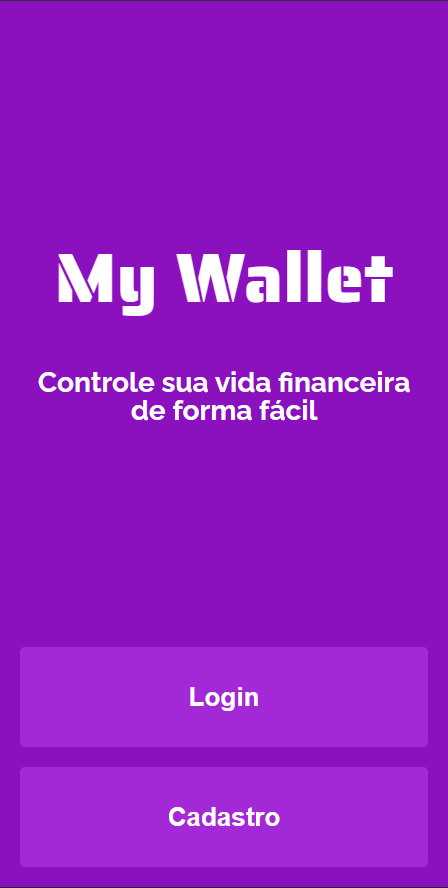
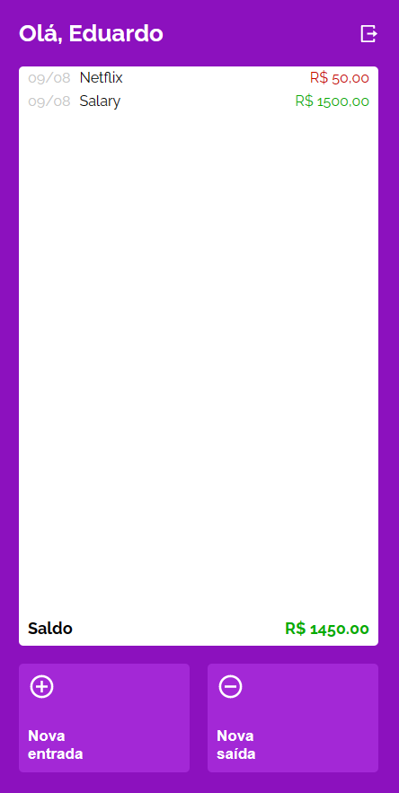

# My Wallet

A simple to use app to manage all your incomes and expenses through a minimalist interface.

<div>
  
  
  
</div>

Try it out now [here](https://my-wallet-bootcamp.vercel.app/ "My Wallet App")

## About

- This is a simple, yet really useful, app that helps you to manage your finances the best way possible. Its interface is straightfoward, which is a good thing, so you don't need to much time to undestand how to use. Just open your app, create an account, and starting adding your new incomes and expenses. Simple right?

## Motivations to delevop this project

- This app was made through my journey to become a fullstack web developer, and it was one the most increadible projects that I've made so far. I loved the concept of it, which is help people in something that is somewhat hard to do (to manage finances). It was really challeging in some parts to delevelop though, especially to work with both frontend and [backend](https://github.com/EduardoVedooto/MyWallet_backend). But I'm very proud of it in the end.
- During its implementation I was able to improve my skills in Styled-components, React Router and learn more about best practices to develop a React App

## Functionalities

- Create an account
- Login and logout
- Add a new income
- Add a new expense

## Next steps

Here as some improvements and new features which I want to implement in the future in this project:

- Remove a entry from history
- Edit a entry, making possible to change the name and value of any entry
- Delete and edit an user account

## Technologies

The following tools and frameworks were used in the construction of the project:<br>

<p>
  
  
  
  
  
</p>

## Getting started

You can install this project in you machine to run locally. To do this, follow the next steps:

1. Clone this repository

```bash
git clone https://github.com/EduardoVedooto/MyWallet_frontend.git
```

2. Open the folder created

```bash
cd MyWallet_frontend
```

3. Install dependencies

```bash
npm i
```

4. Run the project

```bash
npm start
```

5. Finally you'll be redirected automatically to the website on your default browser.

> If your browser didn't open automatically, access http://localhost:3000 on your favorite browser.

## Feedback

Feel free to collaborate opening issues, pull request or just giving me feedbacks of new features you'd love to see in the future on this project. If you want to contact me directly, [here's my email](mailto:vedootoeduardo@gmail.com). I'd love to hear you 😊
